# Restaurant POS Mobile System

A production React Native mobile app built as a waiter terminal for a restaurant POS system. The phone acts as a real-time ordering device connecting to a Windows desktop POS server over a local network via HTTP. Delivered as APK (Android) and TestFlight (iOS) for enterprise internal use. Actively maintained with ongoing feature additions.

> **Role:** Sole Mobile Developer — architecture, UI, all integrations, APK + TestFlight delivery  
> **Client:** Active restaurant deployment (Albania)  
> **Status:** Live and actively maintained

---

## The Problem

The client had a Windows desktop POS managing orders and billing. Waiters had no mobile solution — they took orders manually and relayed them to a fixed terminal. This created errors, delays, and no per-waiter accountability.

The goal: a mobile app where each waiter logs in with their own PIN, manages tables on a live floor map, places orders, applies discounts, closes bills, and prints receipts via Bluetooth — all without touching the desktop.

---

## Technical Challenges Solved

**1. Android Local Network HTTP Restriction**  
Android blocks cleartext HTTP traffic to local IPs by default. Solved by configuring a `network_security_config.xml` policy in `AndroidManifest.xml` to allow cleartext traffic to the desktop server's local IP range.

**2. iOS ATS Exception**  
iOS App Transport Security (ATS) blocks HTTP by default. Configured the equivalent ATS exception in `Info.plist` for the local server domain, ensuring identical behaviour on both platforms.

**3. Bluetooth Thermal Printer (BLE)**  
Implemented BLE scanning, device discovery with RSSI signal strength display, and connection management for thermal receipt printers. Printer settings are persisted per device so waiters don't need to reconnect on every session.

**4. Real-Time Table State**  
Tables have four distinct states — Available, Locked (by another waiter), Reserved, and Occupied — all synced from the desktop server. The floor map reflects live state so waiters avoid conflicts on the same table.

---

## App Flow

### 1. Waiter Selection & PIN Login
Each session starts with waiter selection. The selected waiter authenticates via a numeric PIN pad. Wrong PIN is rejected; correct PIN opens the waiter's personal dashboard.

### 2. Waiter Dashboard
Displays the waiter's personal shift stats: total invoices, current shift revenue, and current day revenue. Actions available: view invoices, view products, open/close shift, or create a new order.

### 3. Floor Map — Table Management
Visual floor map with two zones (Bar, Lounge). Each table shows:
- **Available** (white) — free to seat
- **Locked** (red) — held by another waiter, access denied
- **Reserved** (purple) — upcoming reservation with countdown timer
- **Occupied** (green or amber) — active order in progress, shows waiter name

Two view modes: icon view and list view. Real-time status badges with seat count per table.

### 4. Product Catalogue & Order Building
Product catalogue with category filters (All, Tea, Alcohol, etc.) and live search. Products show price and stock status. Tapping a product adds it to the active order with a quantity badge. Waiter taps "Proceed" when selection is complete.

### 5. Order Management
Order screen shows full invoice metadata: invoice number, date, waiter name, table number. Each line item has quantity controls (+ / −), individual discount fields (percentage or fixed), and a delete option. Order-level discount can also be applied. Running subtotal, discount, and total are shown live at the bottom.

### 6. Item & Order Edit
Each item has an inline edit modal — adjust unit, quantity, price, discount type, discount value, and add a note. Order-level edit modal covers overall discount and service charge with the same type options.

### 7. Table Closing & Billing
Closing a table triggers the billing screen: subtotal, service charge (percentage or fixed), discount, grand total, payment method (Cash / Card / split), and optional customer selection. Toggle options: electronic invoice and print suppression.

### 8. Customer Management
Add new customers inline with name, client ID, address, city, state, country, and active status — used for invoice attribution and customer-facing receipt display.

### 9. QR Invoice Scanner
Camera-based QR code scanner for instant invoice lookup. Requesting camera permission is handled gracefully with a native permission dialog and a settings redirect fallback if denied.

### 10. Daily Sales Summary
End-of-shift summary modal showing all items sold, quantities, discounts, cash total, card total, and waiter total — used by the waiter before confirming shift close.

### 11. Invoice History
Full invoice list with status filters (Pending / Completed) and date range filtering. Each invoice shows table number, order count, subtotal, discount, and total. Direct reprint available from the list via the print button.

### 12. Invoice Detail
Full drill-down into any invoice: table, date, created by, warehouse (Bar/Lounge), itemised order list with quantities and prices, subtotal, and total.

### 13. Settings & Printer Management
Settings screen with toggles: disable all printing, auto-save to JSON, show customer on invoice. BLE printer scanner discovers all nearby Bluetooth devices with RSSI signal strength, allowing the waiter to connect to their printer. Scan complete confirmation toast on success.

### 14. Connection Lost Handling
If the app loses connection to the desktop server, a full-screen modal appears with auto-reconnect status and an Exit option. No silent failures — the waiter always knows the connection state.

---

## Tech Stack

| Category | Technology |
|---|---|
| Framework | React Native, Expo |
| Networking | Axios, Local HTTP (custom network security config) |
| Bluetooth | BLE (react-native-ble-plx) |
| QR Scanning | expo-camera / barcode scanner |
| State Management | React Context API |
| Platform Config | AndroidManifest network security policy, iOS ATS exception |
| Delivery | APK (Android), TestFlight (iOS) |

---

## Screenshots

| Waiter Login | Dashboard | Floor Map (Icon) |
|---|---|---|
| 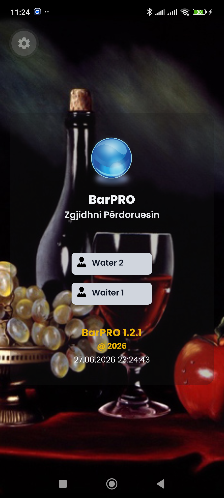 | 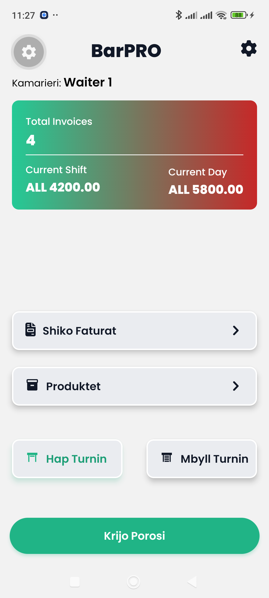 | 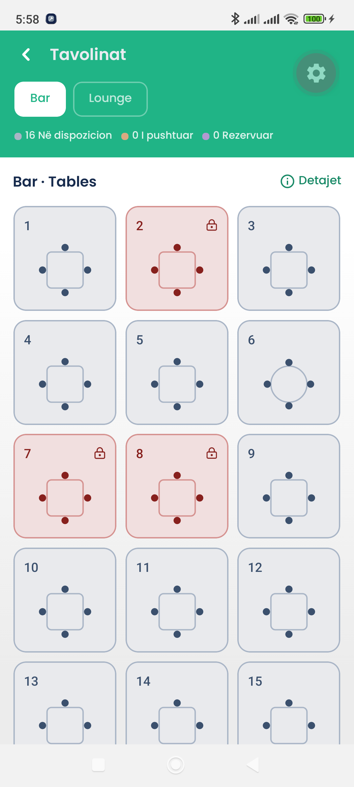 |

| Floor Map (List) | Table States | Product Catalogue |
|---|---|---|
| 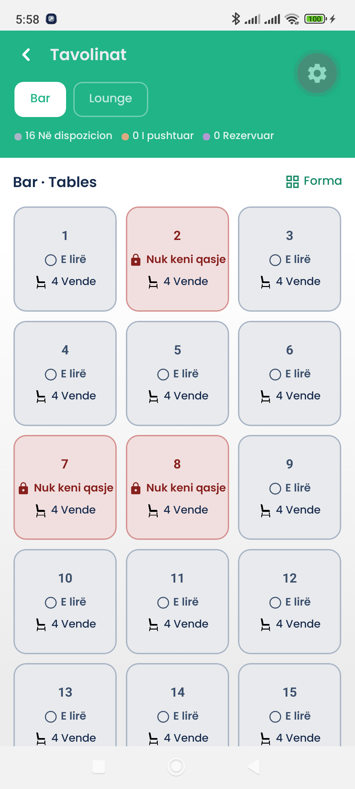 | 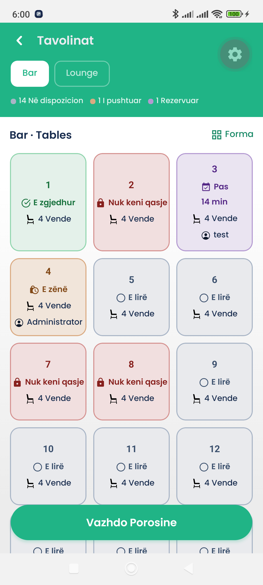 | 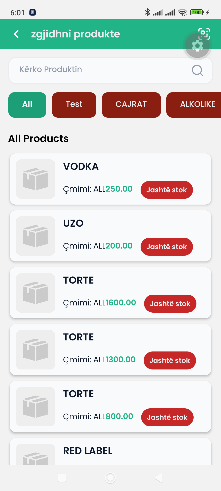 |

| Order Screen | Item Edit | Order Edit |
|---|---|---|
| 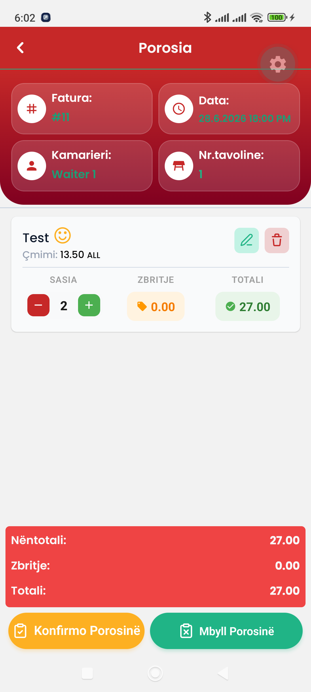 | 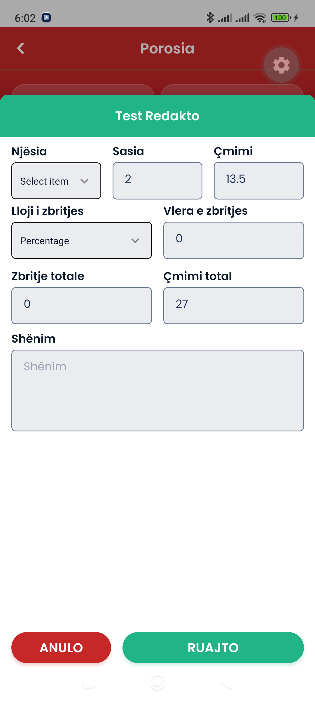 | 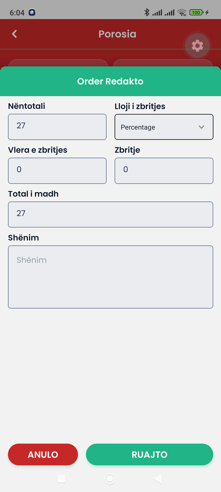 |

| Table Close & Billing | Daily Summary | Invoice History |
|---|---|---|
| 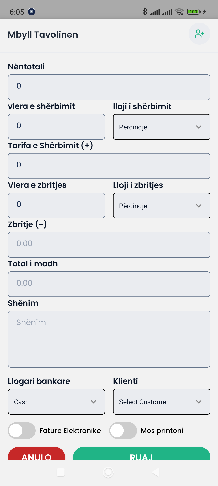 | 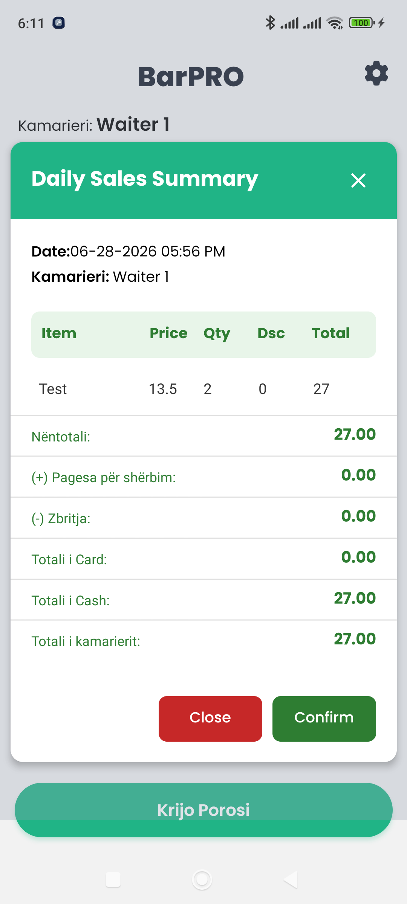 | 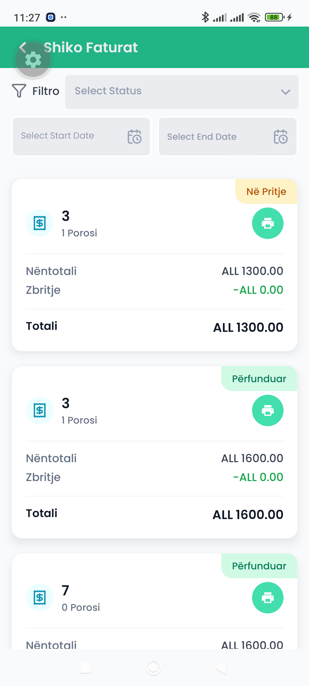 |

| Invoice Detail | QR Scanner | BLE Printer Scan |
|---|---|---|
| 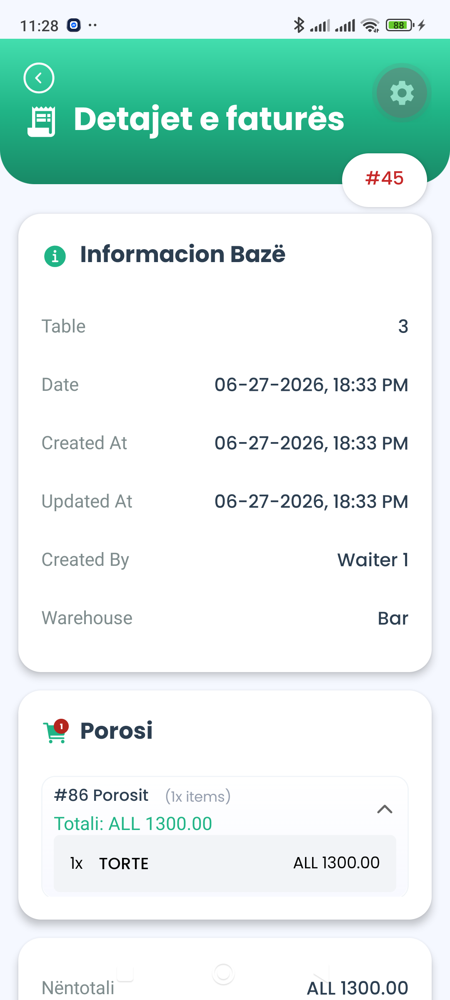 | 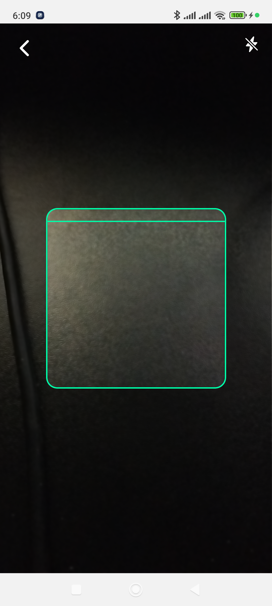 | 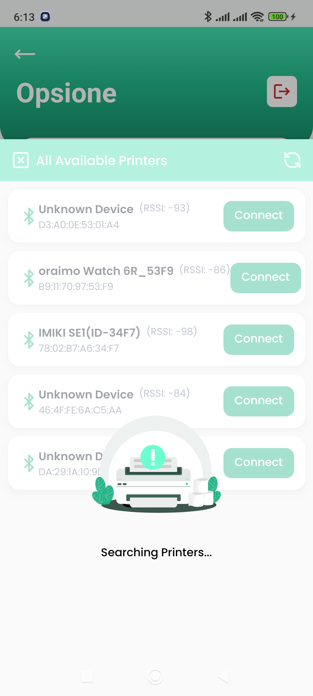 |

| Settings | Connection Lost | Add Customer |
|---|---|---|
| 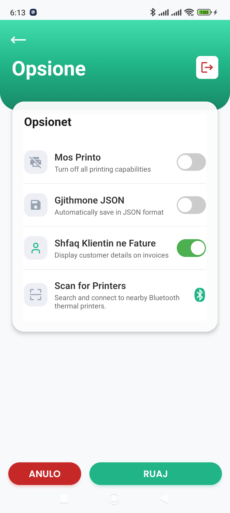 | 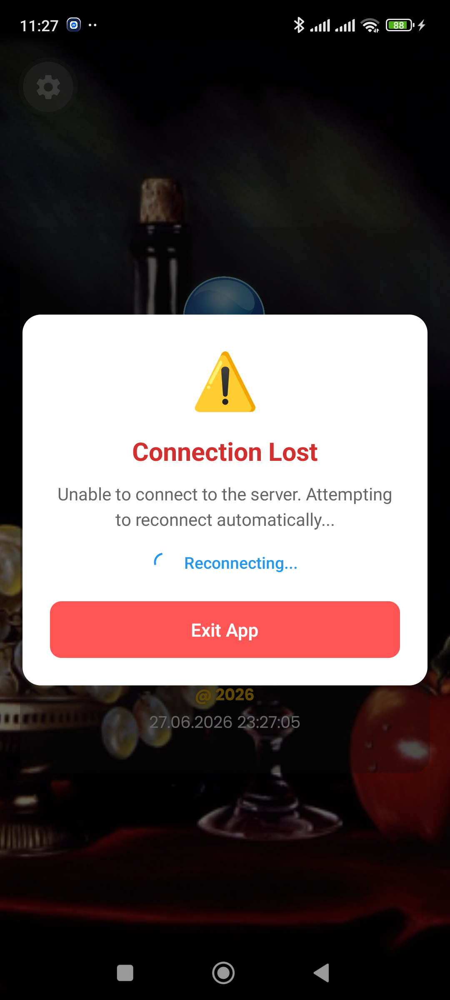 | 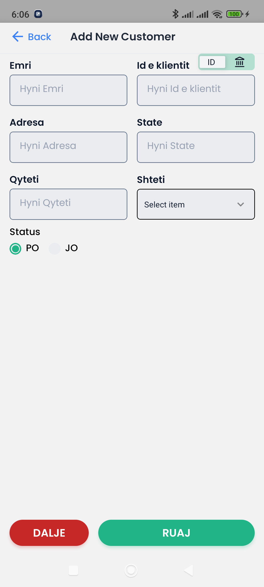 |

---

## Key Implementation Notes

- **No internet required** — the entire app operates over the local restaurant Wi-Fi network. The desktop server is the source of truth.
- **Per-waiter isolation** — each waiter's session is scoped to their PIN login. Table locking prevents two waiters from editing the same table simultaneously.
- **Graceful degradation** — connection loss, camera permission denial, and Bluetooth unavailability all have explicit UI states. Nothing fails silently.
- **Dual platform parity** — every feature works identically on Android and iOS despite the different networking and Bluetooth permission models on each platform.